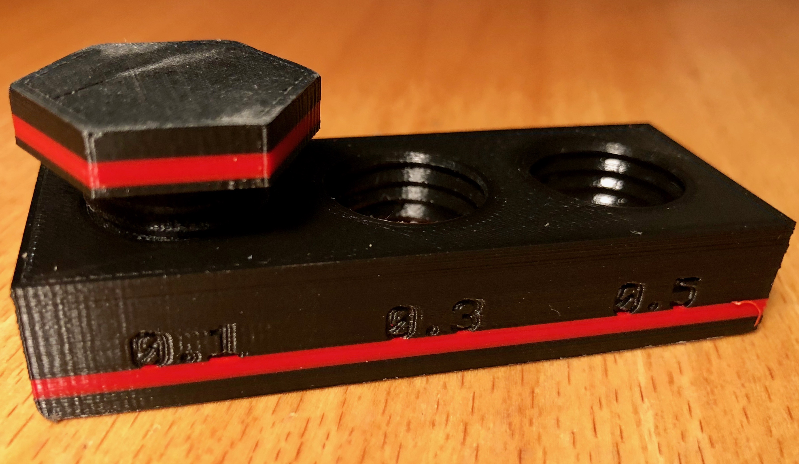

# Generator for threaded cylinders in Cheetah3D

This is a plugin JavaScript for the Cheetah3D Modeler. By default, you can
created threaded cylinders in multiple different ways with Cheetah3D but all
the ones that I tried didn't deliver satisfying results when it came to 3D
printing. And, they all took several steps in the UI.
But Cheetah3D supports custom scripts to be executed from the Tools/Script
menu. I wrote this little JavaScript, which enhances Cheetah3D by a generator
for threaded cylinders. These cylinders can be configured via the Cheetah3D
property manager through attributes like radius, number of thread turns,
thread height... and so on.

The so created threaded cylinders can then be used in conjunction with all
other, normal Cheetah3D objects. You can for example create a bolt nut by using
the boolean operator, subtracting a threaded cylinder from the nut.

## Installation:  
Copy the [Thread.js script](Thread.js) to the

`~/Library/Application Support/Cheetah3D/Scripts/Polygonobj/`

and restart Cheetah3D

## A 3D printing example
The following is an example 3D print (sliced with Cura). The Cheetah3D file
can be [found here](Examples/ThreadTest.jas). It is creating a (left turning)
screw and a block with three screw holes. The most left one is 0.1mm larger
in radius, the middle one is 0.3mm larger in radius and finally the right one
is 0.5mm larger in radius, compared the the screw.

With my 3D printer (Robo R2), using "ultra fine" printing profile, the screw
fits tightly in the 0.1mm hole, easy in the 0.3mm hole and is pretty loose in
the right one. This test was showing me that I should use around 0.15mm radius
tolerance between screws and holes to have a good fit.

*Have fun with this script.*
