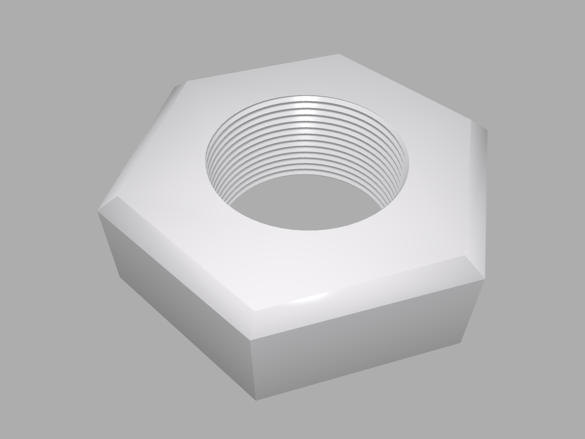

# Generator for threaded cylinders in Cheetah3D

This is a plugin JavaScript for the Cheetah3D Modeler. By default, you can
created threaded cylinders in multiple different ways with Cheetah3D but all
the ones that I tried didn't deliver satisfying results when it came to 3D
printing. And, they all took several steps in the UI.
But Cheetah3D supports custom scripts to be executed from the Tools/Script
menu. I wrote this little JavaScript, which enhances Cheetah3D by a generator
for threaded cylinders. These cylinders can be configured via the Cheetah3D
property manager through attributes like radius, number of thread turns,
thread height... and so on.

The so created threaded cylinders can then be used in conjunction with all
other, normal Cheetah3D objects. You can for example create a bolt nut by using
the boolean operator, subtracting a threaded cylinder from the nut.

## Installation:  
Copy the [Thread.js script](Thread.js) to the

`~/Library/Application Support/Cheetah3D/Scripts/Polygonobj/` 

and restart Cheetah3D 

*Have fun with this script.*
